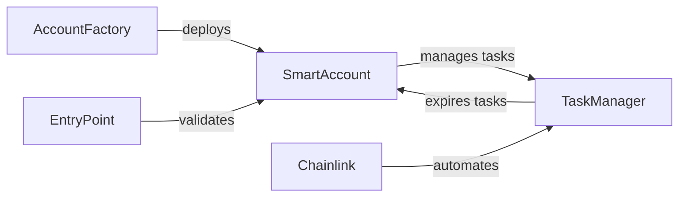

# KAIROS Accountability Wallet

A smart contract system that helps you stay accountable to your goals through financial incentives. Built on ERC-4337 account abstraction with automated task management.

For the full technical specification, see 📄 [Technical Specification](SPECIFICATION.md)

## Overview

KAIROS lets you commit funds to tasks with deadlines. Complete your tasks on time to get your money back. Miss the deadline, and face configurable penalties - either delayed payment or sending funds to a designated "accountability buddy."

### Key Features

- **ERC-4337 Compatible**: Gasless transactions and advanced wallet functionality
- **Automated Task Management**: Chainlink Automation handles precise task expiration
- **Flexible Penalties**: Choose between delayed payments or buddy transfers
- **Deterministic Deployment**: One smart wallet per user with predictable addresses
- **Fund Protection**: Committed task funds are locked and protected from withdrawal

## How It Works

1. **Deploy Your Account**: Get your personal smart wallet through the AccountFactory
2. **Fund Your Wallet**: Add ETH to cover task rewards and transaction fees
3. **Create Tasks**: Set description, reward amount, deadline, and penalty type
4. **Stay Accountable**: Complete tasks before deadlines or face penalties
5. **Get Rewarded**: Successful completion releases funds back to you

## Architecture

The system implements a three-contract architecture:



**Core Components**:
- **AccountFactory**: Creates SmartAccount clones for users
- **SmartAccount**: ERC-4337 wallet with task fund management  
- **TaskManager**: Stores tasks and handles automated expiration
- **EntryPoint**: Standard ERC-4337 contract for UserOperations
- **Chainlink Automation**: Triggers task expiration when deadlines pass

## Contract Addresses

> **Note**: This is a personal project and not production-ready. Deploy your own contracts for testing.

- SmartAccount Implementation: `0x5506c2f71f760e809b0f138ef0045a3591696a19`
- AccountFactory: `0x924bf27b9ae915d3bf065370285193497e938889`
- TaskManager: `0xb9f0c4e18838a1f37cc62b8cd7b558ca8eb7b1dc`

## Getting Started

### Usage Example

```solidity
// Create a task through your SmartAccount
smartAccount.createTask(
    "Complete project milestone",
    "Finish the authentication module by Friday",
    0.1 ether,           // Reward amount
    1 weeks,             // Deadline (from now)
    1,                   // Penalty type: delayed payment
    2 days,              // Delay duration for penalty
    address(0),          // No buddy needed for delayed payment
    0                    // Manual verification
);

// Complete the task before deadline
smartAccount.completeTask(taskId);

// Or let it expire and face the penalty...
```

## Smart Contracts

### SmartAccount
ERC-4337 compatible wallet implementing the IAccount interface with task-specific fund management.

**Key Features**:
- **UserOperation Validation**: EIP-712 signature validation with EntryPoint domain separation
- **Fund Protection**: Committed task rewards locked via `s_totalCommittedReward` accounting  
- **Task Integration**: Direct TaskManager integration for task lifecycle management
- **Penalty Enforcement**: Automated penalty application via `expiredTaskCallback()`
- **EIP-1271 Support**: On-chain signature verification for contract interactions

**Critical Functions**:
```solidity
function validateUserOp(UserOperation calldata userOp, bytes32 userOpHash, uint256 missingAccountFunds)
function execute(address dest, uint256 value, bytes calldata functionData)
function createTask(string calldata description, uint256 rewardAmount, ...)
function expiredTaskCallback(uint256 taskId) // Called by TaskManager
```

### TaskManager  
Centralized task storage and lifecycle management with automated expiration handling.

**Key Features**:
- **Min-Heap Scheduling**: O(log n) insertion/removal for efficient expiration ordering
- **Status Indexing**: Per-account task arrays indexed by TaskStatus for pagination  
- **Chainlink Integration**: AutomationCompatibleInterface for precise task expiration
- **Fund State Tracking**: Coordinates with SmartAccount for reward commitment/release

**Data Structures**:
```solidity
// Global min-heap for expiration scheduling
HeapItem[] private s_heap;
mapping(bytes32 => uint256) private s_heapIndex; // key => index+1

// Per-account status indexing  
mapping(address => mapping(uint8 => uint256[])) private s_tasksByStatus;
mapping(address => mapping(uint256 => uint256)) private s_taskIndexInStatus;
```

### AccountFactory
Minimal proxy factory implementing deterministic SmartAccount deployment.

**Key Features**:
- **EIP-1167 Clones**: Gas-efficient minimal proxy pattern
- **Deterministic Addresses**: `keccak256(abi.encodePacked(owner))` salt generation
- **Immutable Configuration**: EntryPoint and TaskManager addresses fixed at deployment
- **Single Account Per User**: Prevents duplicate deployments via `userClones` mapping

## Penalty Types

### 1. Delayed Payment
- Funds remain locked for additional time after deadline
- Eventually released back to you after delay period
- Good for building patience and reflection

### 2. Buddy Transfer
- Funds immediately sent to designated accountability partner
- Creates external pressure and support system
- Buddy receives the full reward amount

## Development

### Local Setup

```bash
git clone https://github.com/your-username/kairos-accountability-wallet
cd kairos-accountability-wallet
npm install
```

### Smart Contract Development

```bash
# Start local hardhat network
npx hardhat node

# Compile contracts
npx hardhat compile

# Run deployment scripts
npx hardhat run scripts/demo.js --network localhost
```

## Security Considerations

- **Fund Safety**: Committed task rewards are protected from withdrawal
- **Access Control**: Only account owners can modify their tasks
- **Reentrancy Protection**: All state-changing functions are protected
- **Signature Validation**: EIP-712 domain separation for UserOps

## Known Limitations

- **Min-heap Complexity**: Current scheduling system is gas-intensive
- **Single TaskManager**: All accounts share one TaskManager contract
- **No Task Modification**: Tasks cannot be edited after creation
- **Buddy Validation**: Users can currently set themselves as buddy

## Roadmap

### Version 2.0
- [ ] Off-chain task expiration monitoring (replace min-heap)
- [ ] Task modification support (deadline/reward adjustments)
- [ ] Multi-token rewards (ERC-20 support)
- [ ] Enhanced verification methods (attestations, AI validation)
- [ ] Buddy address validation improvements

## License

MIT License - see [LICENSE](LICENSE) file for details.

## Disclaimer

This is an experimental project for learning purposes. The smart contracts have not been audited and should not be used with significant funds. Use at your own risk.

## Contact

Built by Livingstone Z. - [your-contact-info]

---

*"The best accountability system is the one you actually use."*
