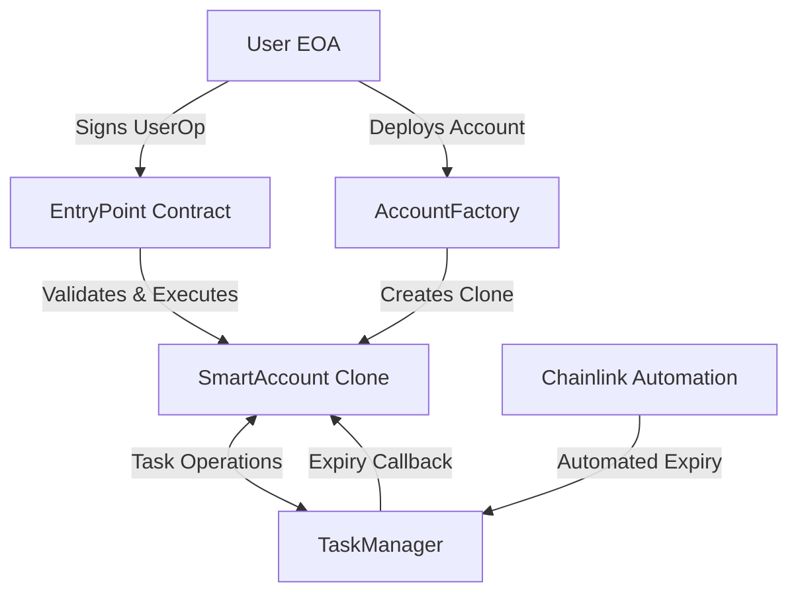
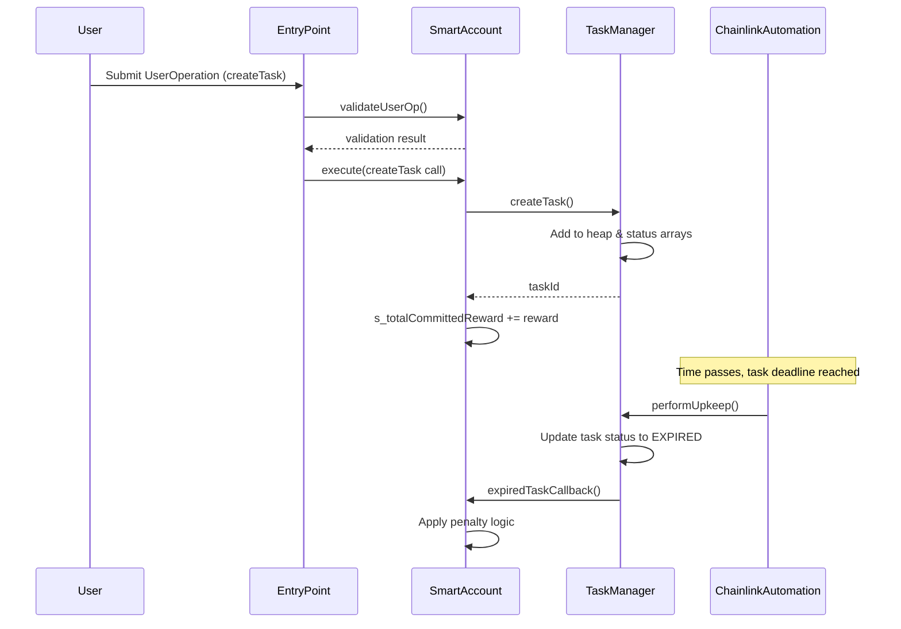
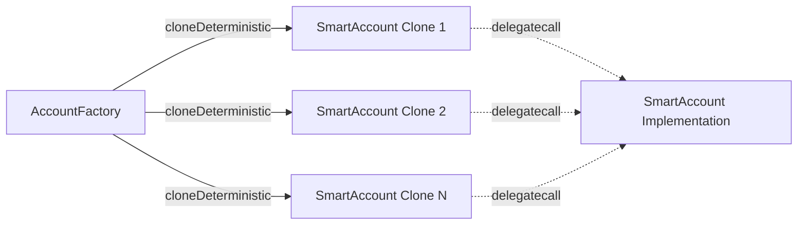
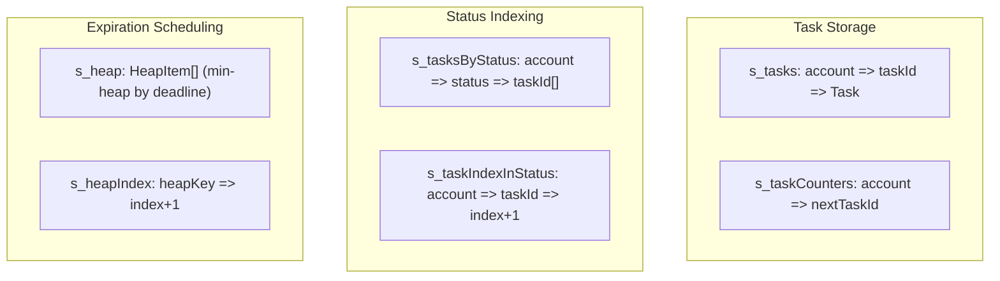
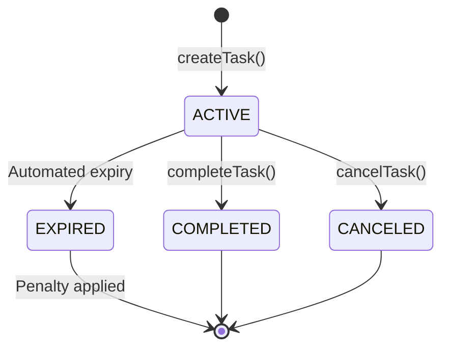
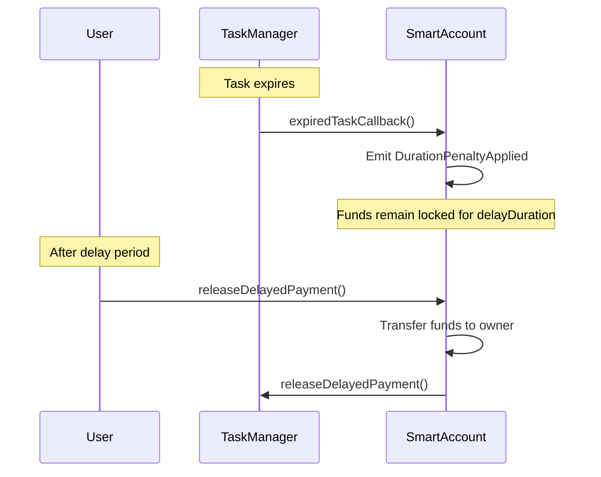
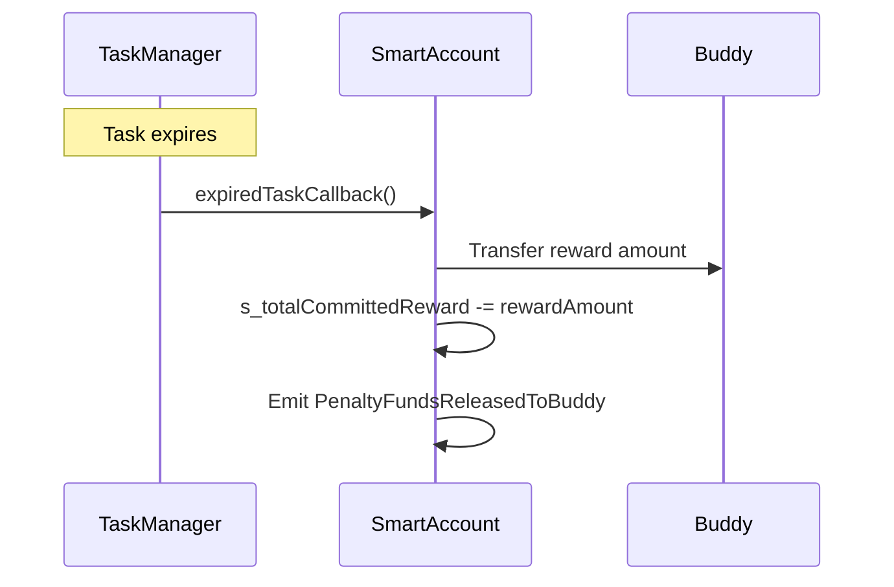
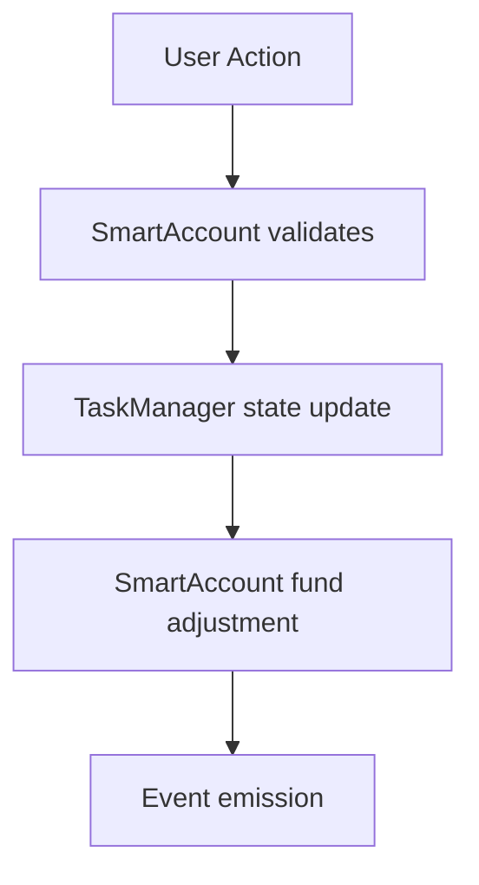

# KAIROS Accountability Wallet - Technical Specification

## Table of Contents
1. [System Overview](#system-overview)
2. [Architecture Design](#architecture-design)
3. [Component Specifications](#component-specifications)
4. [Data Structures](#data-structures)
5. [State Management](#state-management)
6. [Security Considerations](#security-considerations)
7. [Known Limitations](#known-limitations)
8. [Gas Analysis](#gas-analysis)

## System Overview

The KAIROS Accountability Wallet is an ERC-4337 compatible smart contract system that enables users to create accountability tasks with financial incentives and penalties. The system enforces task completion through economic mechanisms, supporting both delayed payment penalties and buddy transfer penalties.

### Core Objectives
- **Task-based Accountability**: Users commit funds to specific tasks with deadlines
- **Penalty Enforcement**: Failed tasks trigger configurable penalty mechanisms
- **Account Abstraction**: Full ERC-4337 compatibility for gasless transactions
- **Automated Task Management**: Chainlink Automation for precise task expiration handling

### System Components
- **SmartAccount**: ERC-4337 compatible wallet with task integration
- **TaskManager**: Centralized task lifecycle and scheduling management
- **AccountFactory**: Deterministic clone factory for SmartAccount deployment

## Architecture Design

### High-Level Architecture



### Contract Interaction Flow



### Deployment Architecture

The system uses a minimal proxy pattern (EIP-1167) for gas-efficient account deployment:



## Component Specifications

### SmartAccount Contract

**Purpose**: ERC-4337 compatible smart wallet with task management integration

**Key Responsibilities**:
- User operation validation and execution
- Fund management with committed reward tracking
- Task lifecycle integration
- Penalty enforcement mechanism

**Critical State Variables**:
```solidity
address public s_owner;                    // Account owner (signer)
IEntryPoint public i_entryPoint;          // ERC-4337 EntryPoint
ITaskManager public taskManager;          // Task management contract
uint256 public s_totalCommittedReward;    // Total funds locked in active tasks
```

**Fund Protection Mechanism**:
The contract prevents withdrawal of funds committed to active tasks through the `contractFundedForTasks` modifier and balance checks in the `execute` function:

```solidity
if (value > (address(this).balance - s_totalCommittedReward)) {
    revert SmartAccount__CannotWithdrawCommittedRewards();
}
```

### TaskManager Contract

**Purpose**: Centralized task storage, lifecycle management, and automated expiration handling

**Key Responsibilities**:
- Task creation, completion, and cancellation
- Automated task expiration via Chainlink Automation
- Efficient task querying with pagination support
- Min-heap based expiration scheduling

**Data Storage Strategy**:



**Min-Heap Implementation**:
The TaskManager uses a min-heap to efficiently track task expirations. The heap operations maintain the invariant that the root element always contains the next task to expire.

```solidity
struct HeapItem {
    address account;
    uint256 taskId;
    uint256 deadline;
}
```

### AccountFactory Contract

**Purpose**: Deterministic deployment of SmartAccount clones

**Deployment Pattern**:
- One account per EOA using `keccak256(abi.encodePacked(owner))` as salt
- Prevents duplicate deployments through `userClones` mapping
- Immutable configuration (EntryPoint, TaskManager) set at deployment

## Data Structures

### Task Structure

```solidity
struct Task {
    uint256 id;                           // Sequential task identifier
    string title;                         // Task title
    string description;                   // Task description
    uint256 rewardAmount;                 // Reward amount in wei
    uint256 deadline;                     // Unix timestamp deadline
    bool valid;                           // Task validity flag
    TaskStatus status;                    // Current task status
    uint8 choice;                         // Penalty type (1=delayed, 2=buddy)
    uint256 delayDuration;               // Delay duration for penalty type 1
    address buddy;                        // Buddy address for penalty type 2
    bool delayedRewardReleased;          // Flag for delayed payment release
    VerificationMethod verificationMethod; // Verification approach
}
```

### Task Status Enumeration



**Status Transitions**:
- **ACTIVE**: Task is in progress, funds are committed
- **COMPLETED**: Task finished successfully, funds released to owner
- **CANCELED**: Task manually canceled, funds released to owner
- **EXPIRED**: Task deadline passed, penalty mechanism activated

### Penalty Mechanisms

**Type 1 - Delayed Payment**:


**Type 2 - Buddy Transfer**:


## State Management

### Fund State Invariants

**Critical Invariant**: `s_totalCommittedReward <= address(this).balance`

This invariant ensures that:
1. All committed funds are backed by actual ETH balance
2. Users cannot withdraw more than their free balance
3. Penalty mechanisms can always execute successfully

**State Synchronization**:
The system maintains state across two contracts (SmartAccount and TaskManager). State changes follow this pattern:



### Heap Maintenance

The min-heap maintains task expiration order with the following properties:
- **Root Property**: `heap[0]` always contains the next task to expire
- **Heap Property**: For any node `i`, `heap[i].deadline <= heap[2*i+1].deadline` and `heap[i].deadline <= heap[2*i+2].deadline`
- **Index Mapping**: `s_heapIndex` provides O(1) lookup for task removal

**Heap Operations Complexity**:
- Insert: O(log n)
- Extract minimum: O(log n)
- Remove arbitrary element: O(log n)

## Security Considerations

### Access Control

**SmartAccount**:
- `requireFromEntryPoint`: Ensures only validated UserOperations can execute
- Owner validation: EIP-712 signature verification for UserOp authentication
- Fund protection: `contractFundedForTasks` modifier prevents over-commitment

**TaskManager**:
- Caller authentication: Only SmartAccount instances can manage their tasks
- State transition validation: Tasks can only move through valid state changes
- Reentrancy protection: `nonReentrant` modifier on state-changing functions

### Attack Vectors & Mitigations

**1. Fund Draining Attack**:
- **Vector**: Attempt to withdraw committed task funds
- **Mitigation**: Balance checks in `execute()` function prevent withdrawal of committed funds

**2. Task Manipulation**:
- **Vector**: Malicious completion/cancellation of tasks
- **Mitigation**: Only account owner (via EntryPoint validation) can modify tasks

**3. Heap Manipulation**:
- **Vector**: Corrupt heap state to prevent/accelerate expiration
- **Mitigation**: Heap operations are internal to TaskManager with proper validation

**4. Buddy Address Exploit**:
- **Vector**: Set own address as buddy to avoid penalty
- **Mitigation**: Currently handled at UI level, contract allows this behavior

### ERC-4337 Security Considerations

**Signature Validation**:
The contract implements EIP-712 domain separation for UserOperation signatures:

```solidity
bytes32 domainSeparator = keccak256(abi.encode(
    DOMAIN_TYPEHASH, 
    nameHash, 
    versionHash, 
    block.chainid, 
    address(i_entryPoint)
));
```

**Replay Protection**:
Nonce management is delegated to the EntryPoint contract, which handles sequential nonce validation.

## Known Limitations

### Technical Limitations

**1. Heap Implementation Complexity**:
- **Issue**: Min-heap adds significant gas overhead and complexity
- **Impact**: Higher deployment and execution costs
- **Planned Resolution**: Migration to off-chain automation in v2

**2. Cross-Contract State Synchronization**:
- **Issue**: SmartAccount and TaskManager state can potentially desynchronize
- **Impact**: Fund accounting inconsistencies in edge cases
- **Mitigation**: Extensive testing and formal verification recommended

**3. Task Expiration Precision**:
- **Issue**: Chainlink Automation may have delays in task expiration
- **Impact**: Tasks might expire later than specified deadline
- **Acceptable Trade-off**: System is designed for accountability, not high-frequency trading

**4. Gas Cost Scaling**:
- **Issue**: Heap operations become expensive with large task counts
- **Impact**: Higher costs for users with many active tasks
- **Analysis**: O(log n) complexity limits impact, but still notable for heavy users

### Business Logic Limitations

**1. Buddy Address Validation**:
- **Issue**: Users can set themselves as buddy to avoid penalties
- **Status**: Acknowledged design choice, handled at application level

**2. Single TaskManager Dependency**:
- **Issue**: All accounts depend on one TaskManager instance
- **Risk**: Single point of failure for task operations
- **Mitigation**: TaskManager address is immutable, requiring new factory for upgrades

**3. No Task Modification**:
- **Issue**: Tasks cannot be modified after creation
- **Impact**: Requires cancellation and recreation for changes
- **Design Choice**: Simplifies contract logic and prevents manipulation

## Gas Analysis

### Operation Cost Analysis

**Task Creation**:
- Base task storage: ~20,000 gas
- Heap insertion: ~5,000 gas (logarithmic in heap size)
- Status array update: ~5,000 gas
- Total estimated: ~30,000 gas + UserOp overhead

**Task Completion**:
- Status updates: ~10,000 gas
- Heap removal: ~8,000 gas (logarithmic)
- Fund transfer: ~21,000 gas
- Total estimated: ~40,000 gas + UserOp overhead

**Account Deployment**:
- Clone deployment: ~45,000 gas
- Initialization: ~35,000 gas
- Storage writes: ~20,000 gas
- Total estimated: ~100,000 gas

### Optimization Opportunities

**1. Status Array Optimization**:
Current implementation uses individual arrays per status. A single array with status filtering could reduce gas costs.

**2. Heap Simplification**:
Migration to off-chain expiration checking would eliminate heap maintenance costs entirely.

**3. Batch Operations**:
Supporting batch task operations could amortize fixed costs across multiple tasks.

## Future Improvements

### Version 2.0 Planned Features

**1. Off-chain Automation**:
- Replace min-heap with off-chain task monitoring
- Reduce gas costs by ~60% for task operations
- Improve expiration precision and reliability

**2. Task Modification Support**:
- Allow deadline extension with additional fund commitment
- Support reward amount adjustments
- Enable description updates

**3. Enhanced Verification Methods**:
- Integration with attestation protocols
- Partner verification workflows
- AI-assisted task validation

**4. Multi-Token Support**:
- ERC-20 token rewards
- Stablecoin integration for consistent penalty values
- Multi-asset portfolio management

### Potential Architecture Enhancements

**1. Modular TaskManager**:
- Plugin architecture for different task types
- Custom penalty mechanisms
- Third-party integrations

**2. Social Features**:
- Task sharing and collaboration
- Community accountability groups
- Reputation systems

**3. Advanced Economics**:
- Dynamic penalty adjustment based on success rates
- Reward multipliers for consistent completion
- Insurance mechanisms for high-value tasks

---

*This specification represents the current implementation as of the analysis date. The system is under active development, and implementation details may evolve.*